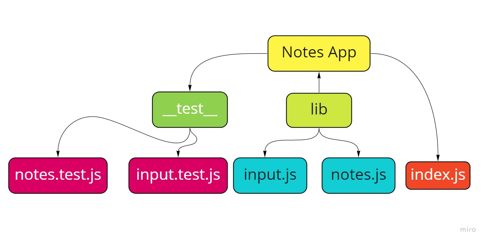

# Notes CLI App

Welcome to thi CLI app, please follow the below instructions to use this app properly

How to run this app
To run the app simply type --add or a then space then your note, please make sure to inter the command correctly otherwise you will receive an error message.

Testing instructions:
after you added your notes, you can test your app, easily type npm start to check your solution.

