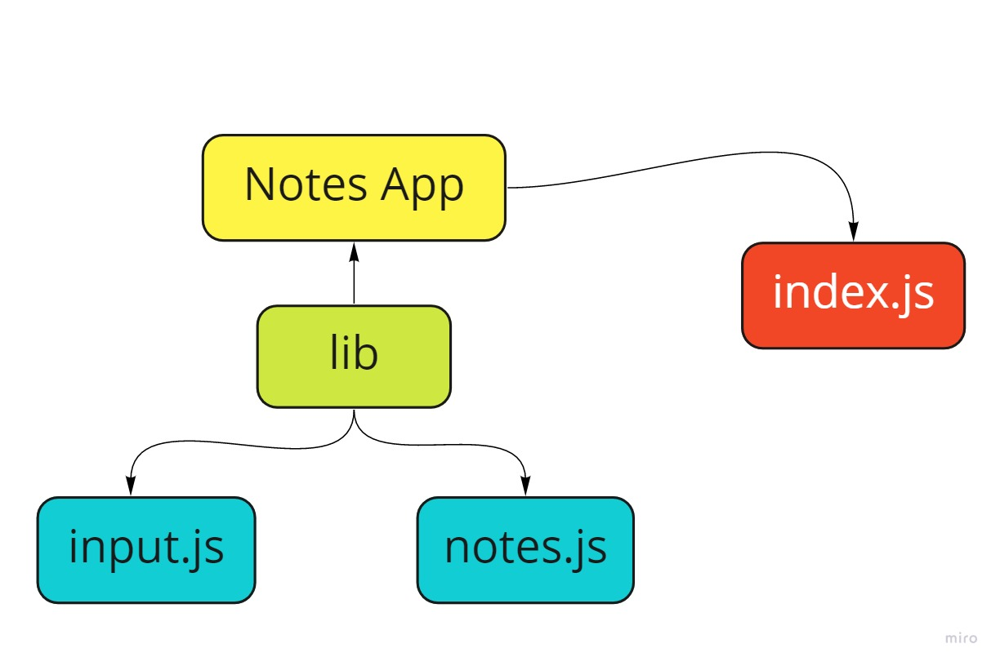

# Notes CLI App

Welcome to thi CLI app, please follow the below instructions to use this app properly

**How to run this app**
To run the app simply type --add or a then space then your note, please make sure to inter the command correctly otherwise you will receive an error message.

**Testing instructions:**
after you added your notes, you can test your app, easily type npm start to check your solution.

**Adding to Database:**
simply type node index.js --add=<insert your note here> --category<pick a category for you note> then enter

**List all notes**
simply type node index.js --list will show all your notes

**List specific category:**
simply type node index.js --list --category<type your category here> will show all your notes associated to that category

